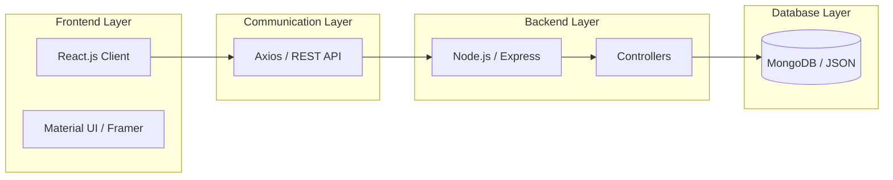

# 🚀 A. Mohamed Yasar | Full-Stack MERN Portfolio

A high-performance Full-Stack Portfolio built with the MERN stack (MongoDB, Express, React, Node.js). Featuring a modern design, real-time system metrics, and automated email notifications.

---

## 🏗️ How it works

I built this project with a **decoupled architecture**, where the Frontend and Backend work separately:

1.  **Frontend (Client):** A React app in the `/client` folder that handles the UI and animations.
2.  **Backend (Server):** A Node.js/Express app in the `/server` folder that handles the data and security.

### 🔄 How They Communicate?



The two layers are linked via a **REST API Bridge**:
- **Protocol:** I used **Axios** for sending requests from the frontend to the server.
- **Data:** The server responds with **JSON data** which the React frontend then displays.
- **Example:** When you click "Projects", the frontend asks for `/api/fragments/projects`, the server gets the data, and shows it on the screen.

---

## ✨ Features

-   **Modular Data Loading:** Fragment-based progressive loading for optimal performance.
-   **Modern UI/UX:** Responsive design using Material UI and Framer Motion.
-   **Real-time Synchronization:** Live visitor tracking and instant inquiry notifications via Socket.io.
-   **Data Resilience:** Fallback local storage (JSON) when database connectivity is unavailable.
-   **Automated Communication:** Integrated email system for contact form notifications and auto-replies.
-   **System Status:** Live tracking of system health and performance metrics with real-time logging.

## 🛠️ Technology Stack

-   **Frontend:** React.js, Material UI (MUI), Lucide Icons, Framer Motion, Socket.io-client.
-   **Backend:** Node.js, Express.js, Socket.io, Nodemailer.
-   **Database:** MongoDB (with Local JSON Fallback).
-   **Utilities:** Axios, Dotenv, CORS, Helmet, Compression.

## 📦 Project Structure

```bash
mern-portfolio-yasar/
├── 🌐 client/          # React.js Frontend (View Layer)
│   ├── src/
│   │   ├── components/  # Modular UI Fragments
│   │   ├── services/    # API Consumer (Axios)
│   │   └── config.js    # Client-side settings
└── ⚙️ server/          # Node.js Backend (Logic Layer)
    ├── controllers/    # Request Handling logic
    ├── routes/         # API Route definitions
    ├── services/       # Email & Logic Utilities
    └── models/         # Data Schema Architecture
```

### 🚀 Production Deployment
1.  **Build the Client:**
    ```bash
    cd client
    npm run build
    ```
2.  **Run the Server (Production Mode):**
    ```bash
    cd server
    # Set NODE_ENV to production
    npm start
    ```
    The server will automatically serve the optimized React build from the `client/build` folder.

## 📜 License

This project is licensed under the MIT License - see the [LICENSE](LICENSE) file for details.

---
Built with ❤️ by **A. Mohamed Yasar**
