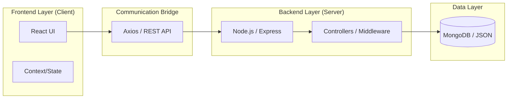

# Project Architecture & Engineering

> [!IMPORTANT]
> **Project Overview**
> *   **Frontend:** React application.
> *   **Backend:** Express server.
> *   **API:** REST API using Axios.

---

## 1. Project Structure
The project is built with a clear separation between the frontend and backend. This makes the code easier to maintain and scale.

### **How it works:**
*   **Frontend (Client):** Located in the `/client` directory. This is the user interface built with React.js. It handles the visuals, animations, and how users navigate the site.
*   **Backend (Server):** Located in the `/server` directory. This is the brain of the app. It handles security, data, and logic.
*   **Communication:** The client and server talk to each other using a REST API via the Axios library. This means they are independent—you can update one without breaking the other.

---

## 2. Reliable Data Handling
To keep the portfolio online even without a database, the backend has a backup system:
* **Database**: Normally, it uses MongoDB for storage.
* **Local Backup**: If the database is down, it automatically switches to local JSON files.
* **Why**: This ensures the site never crashes even if there are database issues.

## 3. Fast Loading
The app loads data in parts to keep it fast:
* **Initial Load**: Core info is loaded first so the page shows up immediately.
* **Background Loading**: Other details like projects and skills load in the background as you scroll.

## 4. Frontend Engineering
The presentation layer is a showcase of modern React.js capabilities:
* **Framer Motion Integration**: Elements enter the page with smooth, synchronized animations. I used `AnimatePresence` and `motion.div` for high-performance transitions.
* **Glassmorphism & Theming**: The UI is built using a custom design system layered over **Material UI (MUI)**. We use strict CSS variables (`index.css`) to enforce the *Indigo-Rose* aesthetic, complete with `backdrop-filter: blur(24px)` glass cards and dynamic gradient borders.
* **Data Visualization**: Complex skill matrices and performance metrics are rendered dynamically using **Recharts**. We strictly enforce dimensional boundaries (`height={350}`) to avoid ResizeObserver calculation bugs during React's initial render cycle.

## 5. Cross-Window Communication (Iframe Bridge)
The Professional Resume viewer is an isolated HTML page embedded via an `<iframe>`. 
* **The Problem**: Browsers block parent apps from tracking mouse coordinates inside an iframe, which usually breaks custom cursors.
* **The Solution**: I built a communication bridge. The iframe sends its mouse coordinates to the parent React window via `window.postMessage()`. The React app then uses these coordinates to move the custom cursor smoothly over the iframe.

## 6. Security & Network Protocols
The backend enforces strict networking rules:
* **CORS Whitelisting**: The API rejects requests from unknown origins, exclusively allowing traffic from `localhost`, `127.0.0.1`, and our authorized production deployment URLs.
* **Network Error Screen**: If the frontend completely loses connection to the backend API, the application intercepts the global Axios error and triggers a cinematic, full-screen **Network Alert Interface**, gracefully explaining the issue rather than silently freezing.
* **Email Dispatch Integration**: The Contact form safely formats and delegates messages directly to secure email clients, ensuring privacy and bypassing the need to store sensitive PII in our own database.

## 7. Codebase Cleanup
The project has been thoroughly cleaned to improve performance:
* Unused logic, redundant controllers, and bloated packages were removed.
* The result is a lightweight, decoupled MERN architecture with a fast production build.
