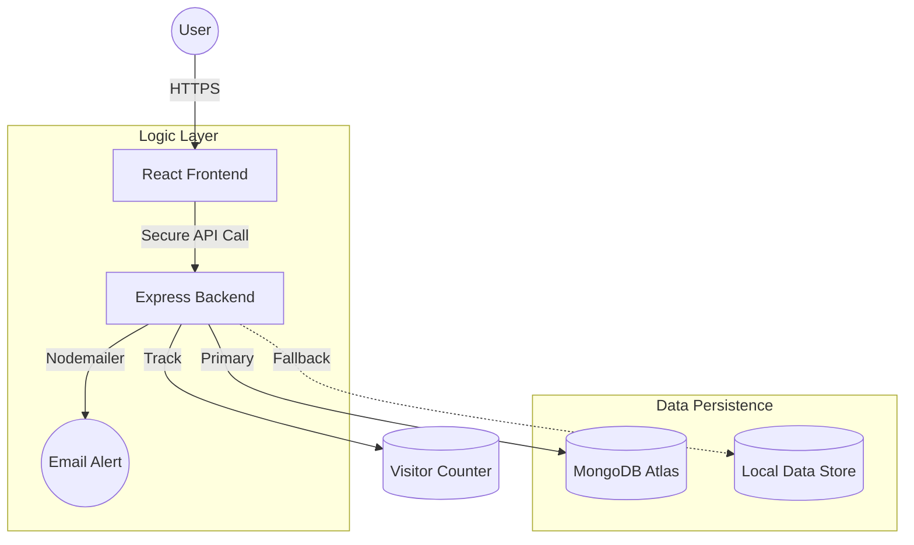

# 🚀 MERN Full-Stack Portfolio

### Engineered by [Mohamed Yasar](https://github.com/mdyasar49)


---

## 💎 Project Goal

This portfolio is a showcase of my skills in the **MERN Stack**. I built it as a decoupled system where the Frontend (React) and Backend (Node/Express) function as independent entities, communicating over a secure REST API.

> **Goal:** To demonstrate clean code practices, modular architecture, and a modern user experience.

---

## 🛠️ Key Highlights

| Feature                | Solution                                                                                                                   | Impact                                                                              |
| :--------------------- | :------------------------------------------------------------------------------------------------------------------------------------- | :---------------------------------------------------------------------------------- |
| **Technical Insight**  | **Interactive Details**. A custom component that shows the technical details of the project as you explore.                           | Provides transparency and demonstrates the logic behind the code.                  |
| **Data Resilience**    | **Hybrid Storage Layer**. Automatically switches between MongoDB Atlas (Primary) and local JSON (Fallback).                           | Portfolio remains 100% functional even if the database is offline.                 |
| **Activity Logs**      | **System Status Feed**. Shows real-time system status and connection logs for a technical feel.                                       | Enhances engagement for technical visitors.                                         |
| **Interactive Resume** | **Integrated PDF Viewer**. A dedicated page to view and download my professional resume with ease.                                    | Professional distribution of my credentials.                                        |

---

## 🏗️ System Architecture Overview



---

## 📡 Client & Server Separation

The project is divided into two separate parts:

1.  **Frontend (Client):** The user interface built with **React.js**. It lives in the `/client` folder.
2.  **Backend (Server):** The API server built with **Node.js and Express**. It lives in the `/server` folder.

### How do they communicate?
The client and server talk to each other using a **REST API**. 
- The **Client** sends requests for data using **Axios**.
- The **Server** processes the request and sends back a **JSON** response.
- This decoupling allows for independent development and scaling of both layers.

---

## 📁 Project Structure

```text
mern-portfolio-yasar/
├── 🌐 client/               # React Interface
│   ├── src/components/      # UI Components (Hero, Projects, Skills, etc.)
│   ├── src/hooks/           # Custom React Hooks
│   ├── src/services/        # API Service (Axios)
│   └── public/docs/         # Markdown Documentation
└── ⚙️ server/               # Node.js Backend
    ├── controllers/         # Request Handling Logic
    ├── services/            # Email Service
    ├── middleware/          # Security & Error Handling
    └── data/                # Local JSON Fallback Data
```

---

## 🚀 Getting Started

### 1. Backend Setup

```bash
cd server
npm install
# Create .env: PORT=5001, MONGO_URI, CLIENT_URL, EMAIL_USER, EMAIL_PASS
npm run dev
```

### 2. Frontend Setup

```bash
cd client
npm install
npm start
```

---

## 📡 Main API Endpoints

| Method | Endpoint                | Purpose           |
| :----- | :---------------------- | :---------------- |
| `GET`  | `/api/profile`          | Fetch Profile Data|
| `GET`  | `/api/visitors`         | Visitor Tracking  |
| `POST` | `/api/contact`          | Contact Form      |
| `GET`  | `/api/fragments/:type`  | Modular Data      |

---

## 🚀 Performance & Optimization

- **Progressive Hydration:** Data is loaded in fragments to keep the initial load time minimal.
- **Lazy Loading:** React components are lazy-loaded to reduce the main bundle size.
- **Memoization:** Used `React.memo` and `useMemo` to prevent unnecessary re-renders.
- **Responsive Design:** Fully optimized for all screen sizes (Mobile, Tablet, Desktop).

---

## 🔮 Roadmap

- [x] **Technical Documentation Audit:** Comprehensive annotation of all core logic.
- [ ] **Dark/Light Mode Orchestration:** Advanced theme switching with persistent user preference.
- [ ] **Technical Deep-Dive:** Adding more detailed explanations for core components.
- [ ] **Enhanced Testing Suite:** Implementing Jest and Cypress for 100% core logic coverage.

---

## 🤝 Let's Connect

I am always looking for challenges that push the boundaries of what is possible on the web.

- **GitHub:** [@mdyasar49](https://github.com/mdyasar49)
- **LinkedIn:** [Mohamed Yasar](https://linkedin.com/in/mdyasar49)

---

_"Clean code is not just written; it's engineered."_
