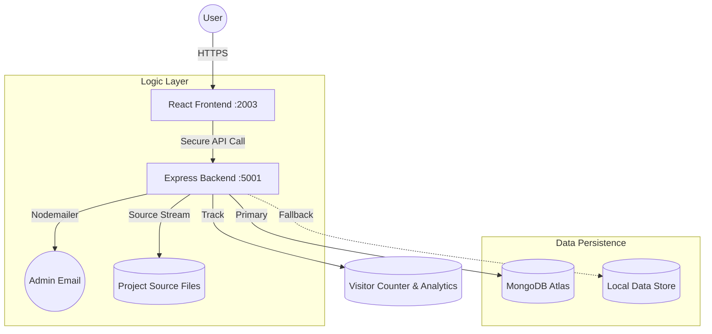

# 🚀 MERN Full-Stack Portfolio

### Engineered by [Mohamed Yasar](https://github.com/mdyasar49)


---

## 💎 Project Goal

This isn't just a portfolio; it's a **Production-Grade Simulation**. Most beginners build static sites; I engineered a decoupled system where the Frontend (React) and Backend (Node/Express) function as independent entities, communicating over a secure REST API.

> **Goal:** To demonstrate architectural excellence, clean code practices, and a "User-First" design philosophy.

---

## 🛠️ Key Architectural Highlights

| Feature                | Engineering Solution                                                                                                                   | Impact                                                                              |
| :--------------------- | :------------------------------------------------------------------------------------------------------------------------------------- | :---------------------------------------------------------------------------------- |
| **Code Live Mode**     | **Interactive Source Stream**. Real-time split-screen viewer that fetches actual Frontend and Backend source code as you navigate.     | Provides 100% architectural transparency and demonstrates "Under-the-Hood" logic.   |
| **Technical Audit**    | **Elite Annotation Layer**. Every core module is line-by-line annotated in English, explaining purpose and implementation logic.       | Ensures the codebase is SaaS-ready, professional, and easily maintainable.          |
| **Data Resilience**    | **Zero-Downtime Hybrid Layer**. Automatically switches between MongoDB Atlas (Primary) and `data.json` (Fallback).                     | Portfolio remains 100% functional even if MongoDB connectivity drops.               |
| **Admin Control**      | **Comprehensive Management Hub**. Real-time profile editing, system health monitoring, and proposal management via JWT authentication. | High-fidelity control over the entire ecosystem with secure, persistent updates.    |
| **Activity Logs**    | **Live Activity Feed**. Shows recent visitor activity and system status in real-time.                             | Provides transparency and engagement for visitors.                                  |
| **Interactive Resume** | **Dynamic Action Hub**. Integrated download, print, share, and modal system functionality.                                             | High-fidelity control over resume viewing, generation, and distribution.            |
| **Multilingual**       | **Dynamic Localization Engine**. Real-time Google Translate API integration with a custom Thanglish phonetic layer.                    | Documentation is accessible across multiple dialects with 100% layout preservation. |

---

## 🏗️ System Architecture Overview



---

## 📡 Client & Server Separation

The project is divided into two separate parts that work together:

1.  **Frontend (Client):** This is the user interface built with **React.js**. It handles everything the user sees and interacts with. It lives in the `/client` folder.
2.  **Backend (Server):** This is the engine built with **Node.js and Express**. It handles data, security, and logic. It lives in the `/server` folder.

### How do they talk to each other?
The client and server communicate using a **REST API**. 
- The **Client** sends requests (like "Give me the project list") using a tool called **Axios**.
- The **Server** receives the request, gets the data from the database (MongoDB or a local file), and sends it back as a **JSON** response.
- This separation means the frontend and backend are independent. You can change the design without touching the data logic, and vice versa.

### 🔄 Communication Workflow Example:
To illustrate the synergy between the two layers, here is the lifecycle of a data request:
1.  **Trigger:** A user navigates to the "Projects" section in the **React UI**.
2.  **Request:** React dispatches an asynchronous `GET` request via **Axios** to `http://localhost:5001/api/fragments/projects`.
3.  **Processing:** The **Express Server** receives the request, validates the origin (CORS), and queries the **MongoDB** cluster (or falls back to `projects.json`).
4.  **Response:** The Server sends back a clean **JSON** object containing the project data.
5.  **Render:** React receives the JSON, updates its **State**, and the UI instantly hydrates with the project cards using **Framer Motion** animations.

---

## 📁 Project Structure

```text
mern-portfolio-yasar/
├── 🌐 client/               # React Interface (Standardized UI Components)
│   ├── src/components/      # System HUD, Logs, Code Live Panel, Resume Actions
│   ├── src/hooks/           # Custom Logic (Telemetry, Analytics)
│   ├── src/services/        # API Consumer Layer (Axios)
│   ├── src/context/         # Global State Management (CodeLive, Auth)
│   └── .env                 # Publicly Safe Global Config
└── ⚙️ server/               # Node.js Core (Business Logic)
    ├── controllers/         # Request Orchestration, Proposal Logic, Code Streaming
    ├── services/            # Auxiliary Services (Email/Nodemailer)
    ├── middleware/          # Security & Global Error Handling
    └── data.json            # High-Availability Fallback Store
```

---

## 🚀 Rapid Deployment Guide

### 1. Backend Setup

```bash
cd server
npm install
# Create .env: PORT=5001, MONGO_URI, CLIENT_URL, NODE_ENV, EMAIL_USER, EMAIL_PASS
npm run dev
```

### 2. Frontend Setup

```bash
cd client
npm install
# Create .env: REACT_APP_API_BASE_URL=http://localhost:5001
npm start
```

---

## 📡 Core API Endpoints

| Method | Endpoint                | Purpose           | Intelligence                              |
| :----- | :---------------------- | :---------------- | :---------------------------------------- |
| `GET`  | `/api/code`             | Source Streaming  | Fetches live code for the current module. |
| `GET`  | `/api/profile`          | Core Data         | Supports DB/JSON failover.                |
| `GET`  | `/api/visitors`         | Traffic Analytics | 7-day history & platform metrics.         |
| `POST` | `/api/proposals/submit` | Guest Refinements | Dispatches email alerts to Admin.         |
| `GET`  | `/api/health`           | Status            | Checks if the server and database are active. |

---

## 🚀 Performance & Optimization

- **Code Live Engine:** Optimized the source code streaming protocol with dynamic mapping to minimize server load.
- **Tree Shaking:** Minimized bundle size by selectively importing MUI icons and components.
- **Lazy Loading:** Implemented code splitting for the Resume engine and System HUD components to reduce initial bundle overhead.
- **Memoization:** Used `React.memo` and `useMemo` in high-render components to maintain buttery-smooth performance.
- **Dynamic Translation:** Implemented a custom `translateService` that handles Markdown structural preservation during machine translation.
- **Proposal Protocol:** Engineered a secure administrative workflow where guest refinements are staged as pending proposals, requiring authenticated approval to merge into the live system.

---

## 🔮 Roadmap

- [x] **Code Live Mode:** Real-time architectural transparency engine.
- [x] **Technical Documentation Audit:** Comprehensive annotation of all core logic.
- [ ] **Dark/Light Mode Orchestration:** Advanced theme switching with persistent user preference.
- [ ] **Technical Deep-Dive:** Adding more detailed explanations for core components.
- [ ] **Enhanced Testing Suite:** Implementing Jest and Cypress for 100% core logic coverage.

---

## 🤝 Let's Connect

I am always looking for challenges that push the boundaries of what is possible on the web.

- **GitHub:** [@mdyasar49](https://github.com/mdyasar49)
- **LinkedIn:** [Mohamed Yasar](https://linkedin.com/in/mdyasar49)

---

_"Clean code is not just written; it's engineered."_
